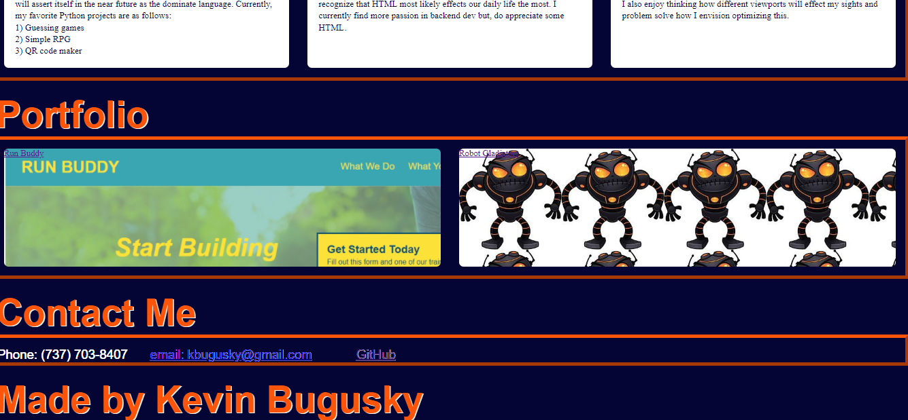

# Professional Portfolio

### As a developer,  I want to create a portfolio so that I can show my skills and knowledge to the future employers. 

## Description

This is a showcase of my skills and knowledge I have acquired. My portfolio is created using ReactJS and deployed to the gh-pages.

<!-- Links to your social media accounts -->
## Contact Me
Email: kbugusky@gmail.com  
Linkedin: https://www.linkedin.com/in/kevinbugusky333454/  
GitHub Deployed: https://k-bugz.github.io/Professional-Portfolio/

## Other 

Have a great day and thank you for being here. 
